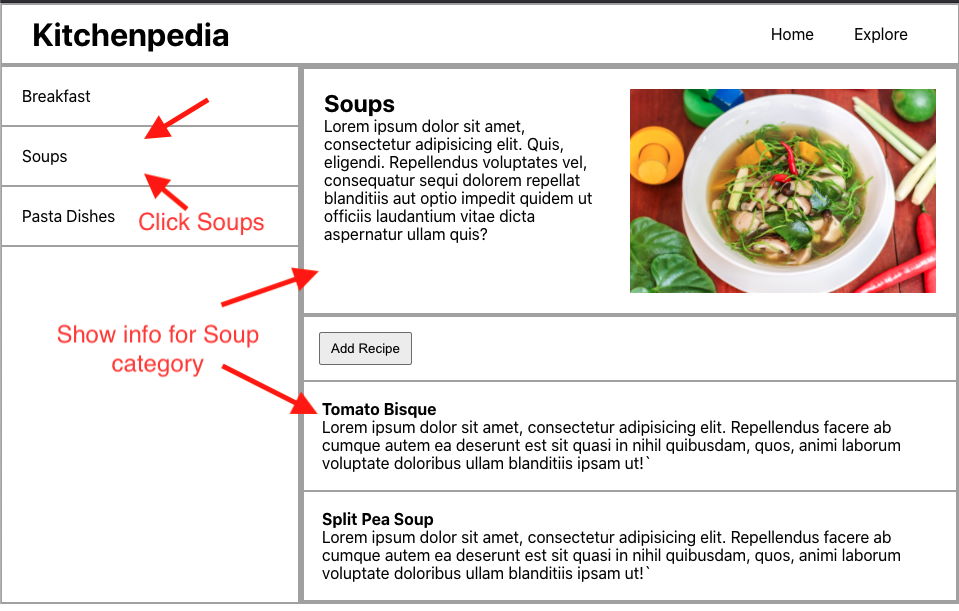
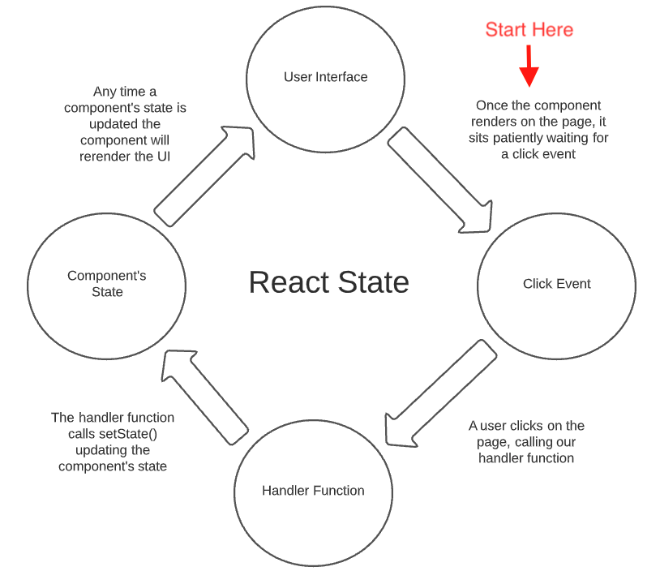

# React State

## Learning Objectives

- Understand how state is used to manage a component that changes over time
- Set up state for a component

## Manually Changing Data on the Page

So far with our Recipe App we are able to pass data to components to make those components dynamic. If we want to display the breakfast categery on the page, we simply pass the data for the breakfast category to the components.

Navigate to the `MainPage.js` component. Try swapping out `categoryData[0]` with `categoryData[1]` for the data being passed to the child components. Try switching it to `categoryData[2]` and then switching it back to `categoryData[0]`. Notice how the page updates to display info for the particular category we specify based on the index position in the `categoryData` array.

## Our Goal

The real goal is to allow the user to click on a cateogry in the sidebar and show the information for that particular category on the right hand side.



### Think Back to jQuery

Think back to how we might do this with jQuery or vanilla JavaScript (the DOM API).

With jQuery or with vanilla JS we would add an event listener to each of the category names in the sidebar, and when each one was clicked, swap out the content on the right hand side with the proper content for that category.

## Introducing State

State is a concept we are actually already familiar with.

You may hear someone refer to "the state of the country" or the "state of affairs". Or perhaps the "state of my bedroom". Any of these things could be in many different states. If we were to describe the state of a bedroom we could say that the bedroom is clean or the bedroom is messy.

## React State

In the same way, our React components could be in many different states. For example, in our Recipe App, we could be displaying the "Soups" category, or we could be displaying the "Breakfast" category. These would be two different states.

We'll simply use React state to describe the current state of our component.

Once we've set it all up, whenever we want to change something on the page, we update our component's state and the component will update itself to display the proper information.

## Converting to a Class-Based Component

Let's take a look at what this will look like in code and navigate to `MainPage.js`.

In order to add state to our component, we are going convert it from a **"Functional Component"** into a **"Class-based Component"**.

First, let's import the React library into our file at the top of `MainPage.js`.

```js
import React from 'react';
```

Now we'll convert `MainPage` to a class-based component. It will look like this with the explaination below.

```js
...

class MainPage extends React.Component {
  render() {
    return (
      <div className="main-page">
        <Sidebar categories={categoryData} />
        <main className="category-info">
          <CategoryDetail category={categoryData[0]} />
          <RecipesList recipes={categoryData[0].recipes} />
        </main>
      </div>
    );
  }
}

...
```
- Switch `function MainPage()` with `class MainPage extends React.Component`. Rather than defining a function for our component we will be defining a class. We're creating a `MainPage` class that extends from **React**'s Component class.

- Create a method called `render` inside the `MainPage` class. We'll have the `render` method return our **JSX**. A class is not able to have a free floating return statement, so React gives us a method called `render` that will be called to return the **JSX** and **render** it to the page.

Once you've converted your component, save the file and check the browser. At this point, everything should look exactly the same.

## Adding State to the Component

<!-- TODO: Instructions for Adding state object and storing categoryIndex -->

In React, a component's state is represented by a JavaScript object that holds all the values in the component's state.

Define a property called `state` as an instance field on the `MainPage` class. Give it a property called `categoryIndex` and set it's value to zero.

```js
...

class MainPage extends React.Component {
  state = {
    categoryIndex: 0
  }

  render() {
    return (
      <div className="main-page">
        <Sidebar categories={categoryData} />
        <main className="category-info">
          <CategoryDetail category={categoryData[0]} />
          <RecipesList recipes={categoryData[0].recipes} />
        </main>
      </div>
    );
  }
}

...
```

We can store any values we want in this state object, except functions. We can store booleans, numbers, strings, arrays, and even other objects.

For our use cases, we only need to store the category index of the curruently active category. We'll see why in a moment.

## Referencing state in a Component

Inside the `render` function we'll now reference the value stored in state. Update the data being passed to the `CategoryDetial` child component and the `RecipesList` child component like so.

```js
...

class MainPage extends React.Component {
  state = {
    categoryIndex: 0
  }

  render() {
    return (
      <div className="main-page">
        <Sidebar categories={categoryData} />
        <main className="category-info">
          <CategoryDetail category={categoryData[this.state.categoryIndex]} />
          <RecipesList recipes={categoryData[this.state.categoryIndex].recipes} />
        </main>
      </div>
    );
  }
}

...
```

We are no longer hard coding an index position for the `categoryData` array. Instead we are referencing the value from the component's state.

Notice we are using the `this` keyword to access the component's `state`. When we render the `MainPage` component it will actually be an instance of the `MainPage` class. Remember that the `this` keyword refers to the instance that get's created. This will start to make more sense the more you work with class-based components.

### Update State Manually

Try updating the `categoryIndex` from `0` to `1` or `2`. You should see the user interface update automatically to display the different categories. 

**Any time a component's state is updated, the component will re-render.** And because our component is referencing state, it will pull in the updated values and display the updated data in the user interface.

<br/>

<details>
  <summary>Hungry for More</summary>

  In 2019, React introduced [**React Hooks**](https://reactjs.org/docs/hooks-intro.html), which allow us to add state to a **Functional Component** and allows us to not use classes.

  Most companies won't necessarily convert their existing React codebase to using **Functional Components**. And for this reason **Class-based components** for adding state in React is still very prominent in the industry and something you will want to be familiar with.
</details>

<br/>

## Creating a Function to Update State

We'll want a function that we can call that will update our component's state for us.

Create an arrow function called `updateCategoryIndex` in the `MainPage` component right under where we set up our component's state. We'll discuss in more detail why we are using an arrow function here. 

```js
...

class MainPage extends React.Component {
  state = {
    categoryIndex: 2
  }

  updateCategoryIndex = (index) => {
    console.log('** called updateCategoryIndex function! **');
  }

  render() {
    return (
      <div className="main-page">
        <Sidebar categories={categoryData} updateCategoryIndex={this.updateCategoryIndex} />
        <main className="category-info">
          <CategoryDetail category={categoryData[this.state.categoryIndex]} />
          <RecipesList recipes={categoryData[this.state.categoryIndex].recipes} />
        </main>
      </div>
    );
  }
}

...
```


## Triggering a State Change

Our goal is to have a user click on one of the caterories and have state update automatically.

## Create a Handler Function

Now we'll add a method to our `MainPage` component who's job it will be to update state. For now we'll just have the method log out a message to the console.

Define a function called `handleCategoryClick` inside the `Sidebar` component.
```js
...

function Sidebar(props) {
  
  function handleCategoryClick() {
    console.log('** A category was clicked **');
  }

  const categoriesList = props.categories.map((category) => {
    return (
      <li className="sidebar-card" key={category._id}>
        {category.categoryName}
      </li>
    );
  });

  return (
    <aside className="sidebar">
      <ul>
        {categoriesList}
      </ul>
    </aside>
  );
}

...
```

## Add an Event Listener

Now we'll add an event listener to to listen for a click on the category name in the sidebar.

Add an `onClick` attribute to the `li` element and set its value to the `handleCategoryClick` function.

```js
...

function Sidebar(props) {
  
  function handleCategoryClick() {
    console.log('** A category was clicked **');
  }

  const categoriesList = props.categories.map((category) => {
    return (
      <li
        onClick={handleCategoryClick}
        className="sidebar-card"
        key={category._id}
      >
        {category.categoryName}
      </li>
    );
  });

  return (
    <aside className="sidebar">
      <ul>
        {categoriesList}
      </ul>
    </aside>
  );
}

...
```

**Test it out!** In the browser, try clicking on a category name in the sidebar. We should see our `console.log` message on each click of a category name! We're successfully triggering some functionality on a click event!

It's important to note that we do not have to call the `handleCategoryClick` function here. We are **not** using parentheses to invoke the function. We're simply passing in a function definition. This will be called later when the click event takes place.

Note that with **React** `onClick` is camel cased. If this were vanilla JavaScript it would be in all lowercase instead.
<details>
  <summary>Hungry for more</summary>
  The reason for using the different syntax is that React wraps the event handlers in something called a synthetic event. Certain DOM events have a slightly different behavior across different browsers. React's synthetic event will take these inconsistencies into account and give our event listeners uniform behavior across all browsers.
</details>

<br/>

## Getting the Index with the Map Method

Eventually we'll need to know which category is clicked on so we can act accordingly. If the soups category is clicked on we want to see the info for soups showing on the page.

We'll use the index value of the category to distinguish which one is clicked on.

JavaScript's [map method](https://developer.mozilla.org/en-US/docs/Web/JavaScript/Reference/Global_Objects/Array/map) gives us access to the index value as we loop through the categories array.

Update the map method to take in the index value like so.

```js
...

const categoriesList = props.categories.map((category, index) => {
    return (
      <li
        onClick={handleCategoryClick}
        className="sidebar-card"
        key={category._id}
      >
        {category.categoryName}
      </li>
    );
  });

...
```

## Pass Parameters an Event Handler

We'll update the `handleCategoryClick` function to take in the index value. For now we'll just log the index to the console.

```js
...

function handleCategoryClick(categoryIdx) {
  console.log('** A category was clicked **');
  console.log(categoryIdx);
}

...
```

Now we'll pass the index to `handleCategoryClick` function in the event handler.

```js
...

const categoriesList = props.categories.map((category, index) => {
    return (
      <li
        onClick={() => handleCategoryClick(index)}
        className="sidebar-card"
        key={category._id}
      >
        {category.categoryName}
      </li>
    );
  });

...
```

**Try it out!**

We should now see the category index being printed to the console on click as well!

Notice how we're wrapping the `handleCategoryClick` function in an **arrow function**. We aren't able to pass a *function call* to our event handler but we are allowed to pass it a *function definition*. By wrapping `handleCategoryClick` in an **arrow function** we're passing a function definition. This arrow function will be called when the category is clicked on, which will, in turn, call `handleCategoryClick` passing in the index.

Do not worry if that doesn't quite make sense yet! This concept takes some time to get used to.

## Passing a Function as Props

Let's make our way back to the `MainPage.js` file. For understanding this next step, it's helpful to have the `MainPage.js` file and the `Sidebar.js` file side-by-side in your code editor.

Now our `Sidebar` component we're listening for a click on a category name which is awesome! Our ultimate goal, though, is to update the state of the `MainPage` component when a category is clicked on.

The `updateCategoryIndex` function is going to be tasked with updating state. We want to call this function when our click event gets triggered.

In order to make this work, pass the `updateCategoryIndex` function as a **prop** to the `Sidebar` component in our **JSX** in the **render** function.

```js
...

render() {
    return (
      <div className="main-page">
        <Sidebar categories={categoryData} updateCategoryIndex={this.updateCategoryIndex} />
        <main className="category-info">
          <CategoryDetail category={categoryData[this.state.categoryIndex]} />
          <RecipesList recipes={categoryData[this.state.categoryIndex].recipes} />
        </main>
      </div>
    );
  }

...
```

## Triggered the Prop Function on Click

Inside `Sidebar.js` we now have access to the `updateCategoryindex` function as a prop.

We'll call the `updateCategoryIndex` function in our click handler function passing it the category index.

```js
...

function handleCategoryClick(categoryIdx) {
  props.updateCategoryIndex(categoryIdx);
}

...
```

**Try it out!**

In the browser, try clicking on a category name now. On click we're triggering the `updateCategoryIndex` function from the `MainPage` component!

## Updating a Component's State

Now for the moment we've all been waiting for. We want to update the state of the `MainPage` component on click!

In `MainPage.js` let's change the `updateCategoryIndex` function to update state.

- Then we'll call `this.setState()` passing in an object with all of the state properties we want to change.

```js
...

updateCategoryIndex = (index) => {
  this.setState({ categoryIndex: index });
}

...
```

In our case we want to update the `categoryIndex` property in state so we'll pass in an object with a key of `categoryIndex` and set the value to the index coming into the function as a parameter.

Every component has access to a method called `setState` that we can call to update the component's state object.

As a rule, anytime a function is triggered by an event, like a click event, we'll want to use an arrow function in our class.

We use an arrow function here to ensure that the `this` keyword points the instance of the `MainPage` class. If we used a regular ES5 function here, as we are using for our `render` method, the `this` keyword would be lost and we would not be pointing to the `MainPage` instance and we wouldn't have access to `setState`. If you're curious try logging out `this` inside the function and see what you get with an arrow function and then with an ES5 function.

**Now try it out!**

Try clicking on a category in the sidebar and see what happens!

It works! When we click on a category, we see the info for that category show up on the right hand side of the page!

But why does this work?

## High Level Concepts

This diagram shows the high level concept of what is happening when we click on a category name in the sidebar.



## In the Context of Our Recipe App

Let's explore what this means for our Recipe App.

In our code editors, pull up `MainPage.js` and `Sidebar.js` side-by-side. We'll trace the path of our code's execution starting in the `Sidebar.js` file.

- When a user clicks on a category name, one of our `<li>` tags it will trigger the `onClick` event.

- This will trigger our handler function, `handleCategoryClick` and pass it the index of the category clicked on as an argument.

- `handleCategoryClick` will then call `updateCategoryIndex` coming from the `MainPage` component, also passing down the category index as an argument.

Moving over to `MainPage.js`

- When `updateCategoryIndex` is called, it will then call `setState`, updating the categoryIndex to the index being passed as a parameter.

- Once state is updated, our component will call its `render` method. (Updating state will always trigger a re-render of our component)

- Because our component is referencing the category index from state, with `this.state.categoryIndex`, it will feed in the updated category data and recipes data into the child components (`CategoryDetail` and `RecipesList`). 

- When `CategoryDetail` and `RecipesList` rerender they will display with the updated data.

- At this point we see the updated data in the browser and our application is patiently waiting for a user to click on it, which will kick off the whole process again.

## Where We Use React State

Now that we are getting to see an example of React state in action let's talk about where we might use state in React.

*We'll use state to store any information in our application that will change over time.*

In this way React takes the place of jQuery. We can use React to dynamically change what is showing up on the page without having to fully refresh the page.

### Strings in State

If we were to add a button on our app to switch our app from a light theme to a dark theme, we might represent that as a string.

```js
state = {
  theme: 'dark'
}
```

If `this.state.theme` is set to 'light', we'll show the light theme. If it set to 'dark', we'll show the dark theme.

### Booleans in State

Let's say we had drop down section on our page for Frequently Asked Questions which could open up and show some content.

We could use a boolean to represent whether the dropdown is opened or closed like this.

```js
state = {
  dropDownIsOpen: true
}
```
If `this.state.dropDownIsOpen` is true we'll display the dropdown to be open. If it is false, we'll display the dropdown closed.

Then in our render function, we would reference this value in state to dynamically hide or show the `<FaqBody />` component.

```js
...

render() {
  return (
    <div>
      <h3>Frequently Asked Questions</h3>
      {
        if (this.state.dropDownIsOpen) {
          <FaqBody />
        }
      }

    </div>
  );
}

...
```

### Arrays in State

Let's say that we had a todo list in our app and we wanted to be able to create and delete todo items in the list. Our list of todos would change over time and we would store it in state. It might look something like this.

```js
state = [
  'walk the dog',
  'get groceries',
  'wash the car'
];
```

### An Array of Objects

Say for example we wanted to track whether or not a todo item has been completed or not. We could store each todo item in an object, like so.

```js
state = [
  {
    todoContent: 'walk the dog',
    completed: true
  },
  {
    todoContent: 'get groceries',
    completed: false
  },
  {
    todoContent: 'wash the car',
    completed: true
  },
];
```

At the moment our category data is being stored as an array of objects. However, our category data is not changing over time. We are not able to create categories or recipes yet, or delete them so we don't need to store the category data in state.

We will get into performing CRUD operations on categories and also retrieving this data from an API. In this case we would store the category data in state to manage all of these changes.
